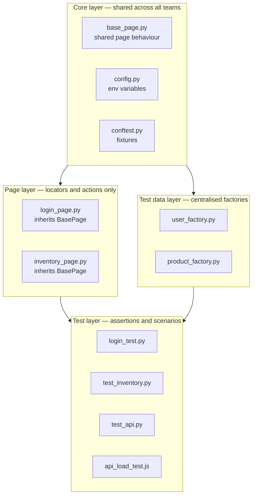
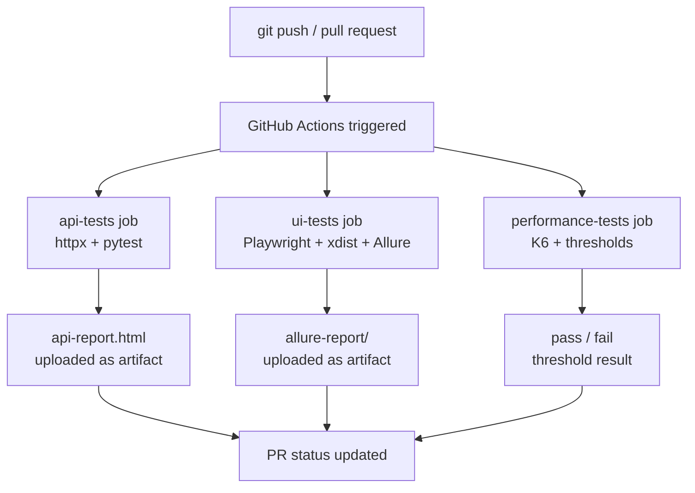
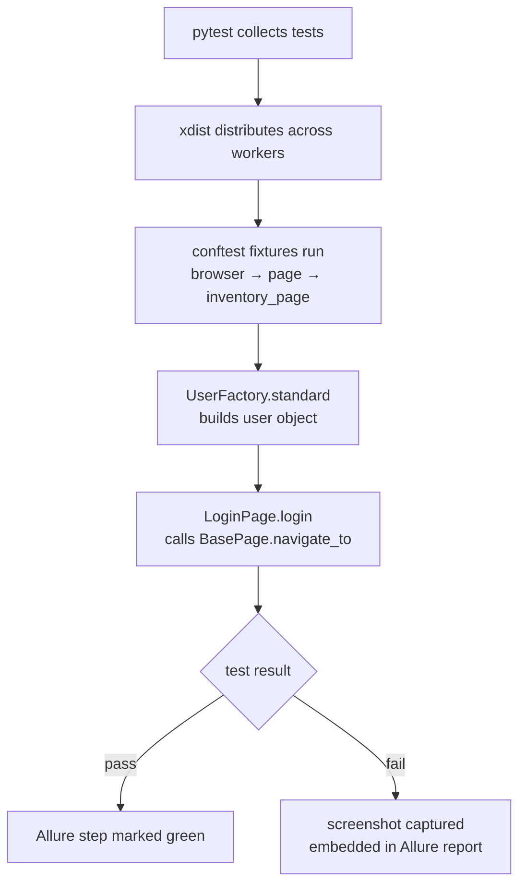
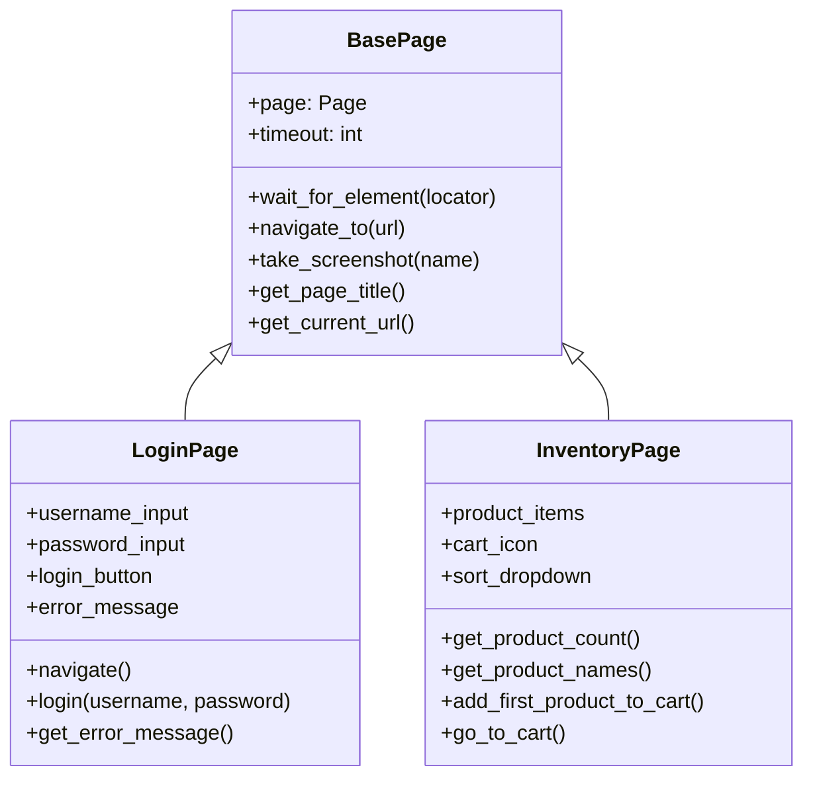
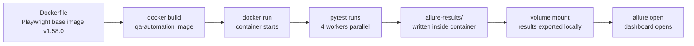
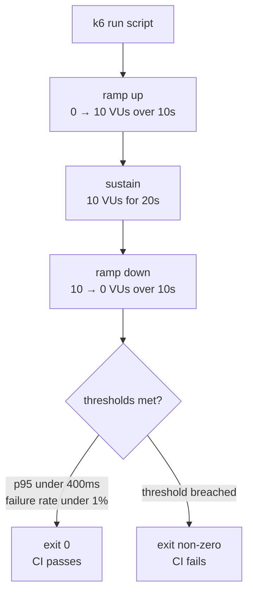

# Architecture — QA Automation Framework

This document covers the framework structure, component relationships, execution flows, CI/CD pipeline design, and the reasoning behind every architectural decision.

---

## 1. Component view

The framework is divided into four layers. Each layer has one responsibility and depends only on layers below it.

---

## 2. CI/CD pipeline flow

Three jobs run in parallel on every push and pull request.

---

## 3. Test execution flow — single UI test

What happens internally when one UI test runs.

---

## 4. Class inheritance — page layer

---

## 5. Docker execution flow

---

## 6. K6 load test flow

---

## 7. Architectural decisions

### Why Playwright over Selenium?

Playwright eliminates browser driver management entirely. Selenium requires downloading and versioning ChromeDriver separately — when Chrome updates you get version mismatches and test failures from infrastructure, not code. Playwright bundles drivers, so all developers run the same version.

Playwright also has built-in auto-waiting. Locators wait automatically for elements to be ready before clicking. Selenium requires manual waits and sleep calls scattered across test code, making tests slower and more fragile.

---

### Why Page Object Model?

Without POM, locators scatter everywhere. If you have 15 login tests and the username field selector changes, you update 15 test files and risk missing one. One miss = one broken test that nobody knows about until CI later. With POM, `LoginPage` owns every login-related locator and action. One selector change = one file update.

POM also makes tests readable. Instead of raw locators, tests say `login_page.login("standard_user", "secret_sauce")` — the test reads like a business scenario, not HTML plumbing.

---

### Why BasePage?

Without `BasePage`, each page class duplicates the same code. Every page needs to wait for elements, navigate to URLs, and capture screenshots. With 5 page objects on a team, you have 5 different wait implementations. `BasePage` defines it once. Every page inherits it automatically. A fix in `BasePage` propagates instantly to all pages in the framework.

At scale with multiple teams, `BasePage` becomes the shared platform layer. Teams focus on page-specific logic. The core team maintains `BasePage`.

---

### Why Factory pattern for test data?

Without factories, credentials scatter across tests. When the test environment password changes, you search for it in 23 test files, update 22, miss the 23rd, and the next day that test fails in CI. The team thinks it's a bug — it's actually a missed credential update.

With `UserFactory.standard()`, credentials live in one place. Tests declare intent — `UserFactory.locked()` tells you immediately this is the locked-user scenario, no reading through magic strings.

---

### Why function scope for browser in parallel runs?

Session scope means one browser object shared across tests in a worker. With xdist, multiple workers run as separate processes — session scope doesn't cross process boundaries reliably. With `-n 2` the suite fails. With function scope, each test gets its own browser — parallel-safe regardless of worker count.

---

### Why parallel execution?

| Mode             | Workers | Time |
| ---------------- | ------- | ---- |
| Sequential       | 1       | ~30s |
| `-n 2`           | 2       | ~15s |
| `-n auto` local  | 16      | ~13s |
| `-n auto` CI     | 4       | ~12s |
| Docker `-n auto` | 4       | ~19s |

In a real suite with 500 tests the difference is 35 minutes vs under 8 minutes. Feedback speed directly affects developer flow.

---

### Why two separate CI jobs for functional tests?

With a single combined job, a flaky UI test marks the entire build as broken — hiding passing API tests. With separate jobs, both report independently. Developers see "API tests passing, UI tests sometimes flaky" — a clear signal of what needs attention. Dependencies are also different — API tests need httpx, UI tests need Playwright. Separate jobs install only what they need.

---

### Why environment variables for BASE_URL?

Hardcoding `https://www.saucedemo.com` in test code means switching to staging requires a code change and a commit. With `os.getenv("BASE_URL", "https://www.saucedemo.com")`:

- Local: defaults to demo site
- CI staging: `BASE_URL=https://staging.example.com`
- Docker: `docker run -e BASE_URL=https://staging.example.com qa-automation`
- Production smoke: another job sets the prod URL

Same test code. No commits. Just environment variables.

---

### Why Allure over pytest-html?

pytest-html produces a flat static file — no filtering, no trend history. Allure gives an interactive dashboard with feature/story grouping, severity filtering, step-by-step breakdown, and screenshots embedded inline in failing tests.

Allure separates raw results from the report. CI generates `allure-results/` (raw JSON). Reports are generated separately and can show trend history across runs. `allure serve` is not run in CI — it starts a web server with no browser to open it. Instead the Allure CLI generates a static report artifact. Always open via `allure open` or `python3 -m http.server` — `file://` protocol blocks Allure's JavaScript.

---

### Why Docker?

Without Docker, "works on my machine" is a real problem. Mac runs Python 3.13, CI runs Python 3.13 on Ubuntu, a colleague's Windows machine has whatever Python version they installed. Browser versions differ. Docker packages everything into one image — any machine with Docker runs the exact same environment.

Image version is pinned to `v1.58.0-noble` — not `latest`. This was learned the hard way: using `v1.51.0` while pip installed `playwright 1.58.0` caused every test to fail with a cryptic executable error. Pinning both together and upgrading deliberately prevents this mismatch.

`requirements.txt` is copied before source code for Docker layer caching — pip install only re-runs when dependencies change, not on every source file change.

---

### Why K6 for performance testing?

K6 tests are JavaScript code — they live in the repo, go through code review, and run in CI. JMeter requires a GUI and produces XML config that's hard to review in pull requests.

K6 thresholds make performance testing meaningful — without them K6 is just a load generator. With `p(95)<400ms` as a threshold, K6 exits non-zero when breached and the CI pipeline fails automatically. Performance regressions are caught the same way functional regressions are.

`p(95)` is used over average because average hides outliers. 94 requests at 10ms and 6 at 5 seconds gives an acceptable average but 6% of users are having a terrible experience. `p(95)` means 95% of users get a response within that time.

K6 scripts deliberately mirror the functional pytest tests — same endpoints, same assertions, different question asked at load.

---

## 8. Summary

| Decision              | Problem solved                                             |
| --------------------- | ---------------------------------------------------------- |
| Playwright            | No driver maintenance, auto-waiting                        |
| POM                   | Locators in one place, tests stay readable                 |
| BasePage              | Shared behaviour without duplication                       |
| Factory pattern       | Credentials in one place, tests declare intent             |
| Function scope        | Parallel-safe browser isolation                            |
| Parallel execution    | 30s → 13s locally, 35min → 8min at scale                   |
| Separate CI jobs      | Failures isolated, dependencies separated                  |
| Environment variables | Same tests across dev, staging, production                 |
| Allure                | Interactive dashboard, embedded screenshots, trend history |
| Docker                | Identical environment on every machine                     |
| K6 thresholds         | Performance regressions caught automatically in CI         |
