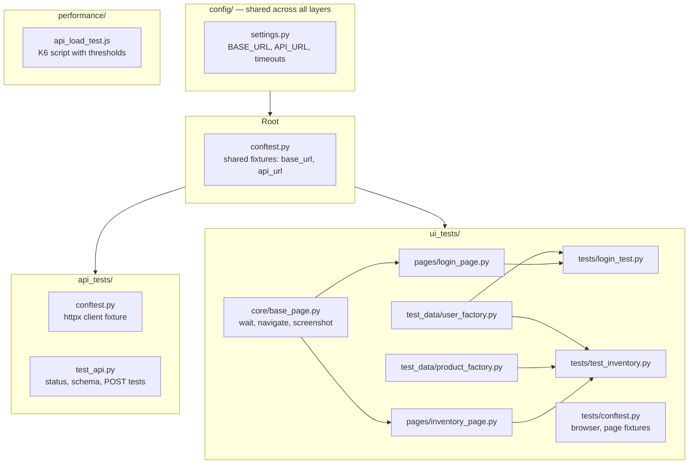
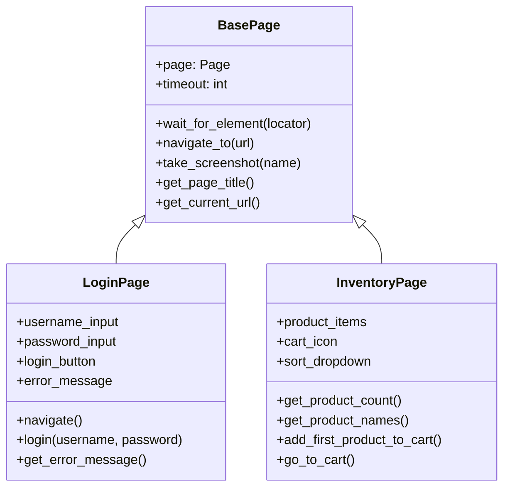
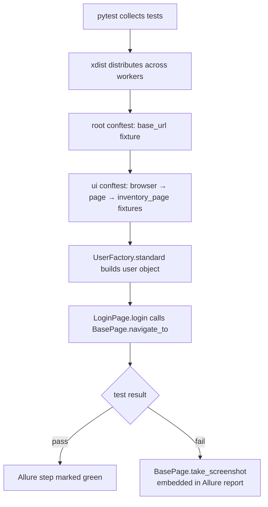
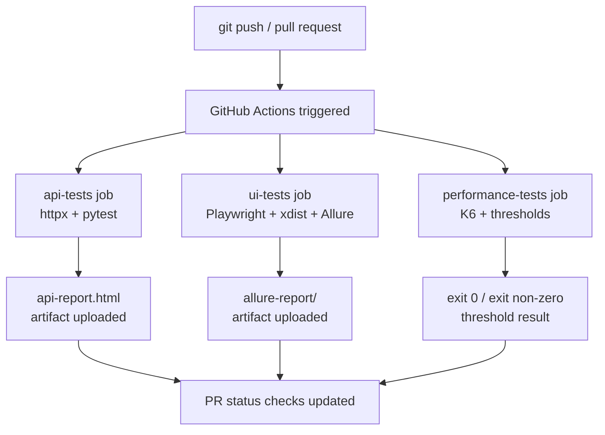
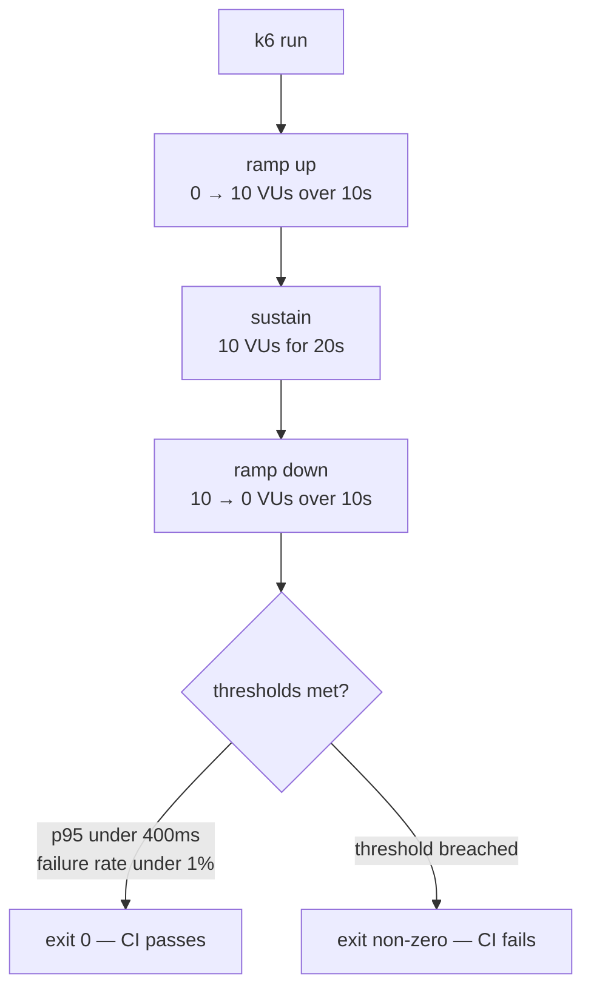
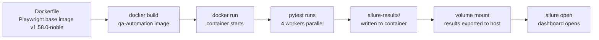

# Architecture — QA Automation Framework

This document follows the arc42 documentation template. It covers goals, context, solution strategy, component structure, runtime behaviour, deployment, and the reasoning behind every significant design decision.

---

## 1. Introduction and goals

### Purpose

This framework demonstrates production-grade automation engineering across three layers — API, UI, and performance — using patterns that apply at scale in real engineering teams.

### Quality goals

| Priority | Quality attribute | How it is achieved                                                              |
| -------- | ----------------- | ------------------------------------------------------------------------------- |
| 1        | Reliability       | Playwright auto-waiting, function-scoped browser isolation, pinned Docker image |
| 2        | Maintainability   | POM, BasePage, Factory pattern — each with a single responsibility              |
| 3        | Fast feedback     | Three parallel CI jobs, pytest-xdist parallel execution                         |
| 4        | Portability       | Environment variables for all config, Docker for environment consistency        |
| 5        | Observability     | Allure reports with embedded screenshots, K6 threshold-based CI failure         |

### Stakeholder concerns

| Stakeholder         | Concern                              | How addressed                                            |
| ------------------- | ------------------------------------ | -------------------------------------------------------- |
| Developer           | Fast feedback on every PR            | CI pipeline completes in ~12s on 4 workers               |
| QA Lead             | Readable, maintainable tests         | POM + Factory pattern — tests read as business scenarios |
| DevOps              | Consistent execution environment     | Docker with pinned image version                         |
| Engineering Manager | Performance regressions caught early | K6 thresholds fail CI automatically                      |

---

## 2. Context and scope

### System context

The framework tests two external systems:

```
┌─────────────────────────────────────────────────────────┐
│                  qa-automation-framework                │
│                                                         │
│  ┌─────────────┐  ┌─────────────┐  ┌────────────────┐  │
│  │  api_tests  │  │  ui_tests   │  │  performance   │  │
│  │  (httpx)    │  │ (Playwright) │  │    (K6)        │  │
│  └──────┬──────┘  └──────┬──────┘  └───────┬────────┘  │
└─────────┼────────────────┼─────────────────┼───────────┘
          │                │                 │
          ▼                ▼                 ▼
  JSONPlaceholder      SauceDemo       JSONPlaceholder
  REST API             web app         REST API (under load)
```

The framework does not own or deploy either system. It treats both as black boxes and tests via public interfaces only.

---

## 3. Solution strategy

### Core technology decisions

| Decision              | Choice         | Primary reason                                              |
| --------------------- | -------------- | ----------------------------------------------------------- |
| Language              | Python 3.12    | pytest ecosystem, httpx, Playwright all first-class         |
| UI automation         | Playwright     | No driver management, built-in auto-waiting                 |
| HTTP client           | httpx          | Async support, cleaner API than requests                    |
| Test runner           | pytest         | Fixtures, parametrize, markers, xdist all native            |
| Parallel execution    | pytest-xdist   | Worker-level parallelism without test code changes          |
| Performance testing   | K6             | JavaScript, code-reviewable, threshold-based CI integration |
| Reporting             | Allure         | Interactive dashboard, trend history, embedded screenshots  |
| Environment isolation | Docker         | Pinned image eliminates "works on my machine" entirely      |
| CI/CD                 | GitHub Actions | Native, no separate server, parallel jobs built-in          |

### Architectural patterns

- **Page Object Model** — UI layer separated from test logic
- **BasePage inheritance** — shared behaviour defined once, inherited by all pages
- **Factory pattern** — test data centralised, tests declare intent
- **Fixture scoping** — function scope for browser, session scope for config
- **Environment variable configuration** — no hardcoded values anywhere

---

## 4. Building block view

### Layer decomposition



### Class hierarchy — page layer



---

## 5. Runtime view

### Single UI test execution



### CI/CD pipeline execution



### K6 load test stages



---

## 6. Deployment view

### Docker execution



### Environment matrix

| Environment       | BASE_URL source                 | How triggered                  |
| ----------------- | ------------------------------- | ------------------------------ |
| Local development | `.env` default or shell export  | Developer runs pytest manually |
| GitHub Actions    | Repository secret / job env var | Push or pull request           |
| Docker local      | `docker run -e BASE_URL=...`    | Manual or scripted             |
| Staging           | CI job environment variable     | Scheduled or manual dispatch   |

---

## 7. Architecture decisions (ADRs)

### ADR-001 — Playwright over Selenium

**Problem:** Selenium requires downloading and versioning ChromeDriver separately. When Chrome updates, driver version mismatches cause test failures from infrastructure, not code.

**Decision:** Use Playwright.

**Rationale:** Playwright bundles browser binaries — all developers and CI run identical versions. Playwright's locators auto-wait for elements to be actionable before interacting, eliminating manual `WebDriverWait` calls and reducing flakiness.

**Alternatives considered:** Selenium 4 with Selenium Manager. Rejected — still requires external driver resolution and lacks the reliability of Playwright's auto-waiting model.

**Consequences:** Tests require Playwright installation (`playwright install chromium`). Framework is Python-only for UI (no cross-language browser sharing).

---

### ADR-002 — Page Object Model

**Problem:** Without POM, locators scatter across 15+ test files. When a selector changes, every file must be updated. One missed file produces a silent broken test.

**Decision:** All locators and page interactions live exclusively in the page layer.

**Rationale:** `LoginPage` owns every login-related locator and action. One selector change = one file update. Tests read as business scenarios (`login_page.login("user", "pass")`) rather than raw HTML manipulation.

**Consequences:** Additional layer of abstraction. New page flows require a new page object before tests can be written.

---

### ADR-003 — BasePage inheritance

**Problem:** Without a base class, each page object duplicates the same wait, navigation, and screenshot logic. Five page objects = five different wait implementations drifting apart over time.

**Decision:** All page objects inherit from `BasePage`.

**Rationale:** `BasePage` defines shared behaviour once. A fix propagates to all pages automatically. At team scale, `BasePage` becomes the platform layer maintained centrally while teams own their page-specific logic.

**Consequences:** All page objects are coupled to `BasePage`. Changes to `BasePage` affect all pages — requires careful review of base class modifications.

---

### ADR-004 — Factory pattern for test data

**Problem:** Credentials scattered across test files. When environment passwords change, you search 23 files, update 22, miss the 23rd, and a CI failure the next day looks like a code bug.

**Decision:** All test data constructed through factory classes.

**Rationale:** `UserFactory.standard()` and `UserFactory.locked()` centralise credentials and communicate intent clearly. Tests declare _what kind of user_ they need, not the raw string values.

**Consequences:** Test data is one more import away. Factories must be kept in sync with test environment credentials.

---

### ADR-005 — Function scope for browser fixtures in parallel runs

**Problem:** Session-scoped browser fixture with xdist. xdist runs workers as separate processes — session scope does not cross process boundaries reliably. With `-n 2`, tests fail intermittently with shared state corruption.

**Decision:** Browser fixture is function-scoped.

**Rationale:** Each test gets its own browser instance. Parallel-safe regardless of worker count. Isolation prevents state leaking between tests.

**Trade-off:** Higher memory usage compared to session scope. Each worker spins up its own browser process. Acceptable at current suite size; would need evaluation at 1000+ tests.

---

### ADR-006 — Separate CI jobs per test type

**Problem:** Combined single CI job means a flaky UI test marks the entire build failed — hiding passing API tests and wasting developer investigation time.

**Decision:** Three separate parallel jobs: api-tests, ui-tests, performance-tests.

**Rationale:** Each job reports independently. "API passing, UI flaky" is actionable. "Build failed" is not. Separate jobs also install only their required dependencies — no Playwright in the API job, no httpx in the K6 job.

**Consequences:** Slightly more CI configuration to maintain. Worth it for clarity of failure signal.

---

### ADR-007 — K6 for performance testing

**Problem:** JMeter requires a GUI to configure, produces XML that is unreadable in pull request diffs, and cannot run meaningfully in CI without a separate server.

**Decision:** K6 with threshold-based CI integration.

**Rationale:** K6 scripts are JavaScript — they live in the repo, go through code review like any other file, and run natively in CI. Thresholds (`p(95)<400ms`) make K6 exit non-zero on breach, so performance regressions fail the pipeline automatically — exactly how functional regressions are caught.

**Why p95 over average:** Average hides outliers. 94 requests at 10ms and 6 at 5 seconds produces an acceptable average while 6% of users experience unacceptable latency. p95 means 95% of users get a response within the stated threshold.

**Consequences:** Team needs basic JavaScript familiarity to maintain K6 scripts alongside Python test code.

---

### ADR-008 — Pinned Docker image version

**Problem:** Using `playwright:latest` in the Dockerfile. When `latest` updated from v1.51.0 to v1.58.0, the pip-installed playwright package (v1.58.0) and the browser binaries in the image (v1.51.0) went out of sync. Every test failed with a cryptic browser executable error.

**Decision:** Pin Docker image to `mcr.microsoft.com/playwright/python:v1.58.0-noble`. Upgrade image version and pip package version deliberately and together.

**Rationale:** Eliminates the entire class of environment mismatch failures. Upgrades become explicit, reviewable commits rather than silent breakage.

**Consequences:** Manual upgrade process required when moving to a newer Playwright version. `requirements.txt` and Dockerfile must be updated in the same commit.

---

### ADR-009 — Environment variables for all configuration

**Problem:** `https://www.saucedemo.com` hardcoded in test code. Switching to staging requires a code change and a commit — the wrong moment to be touching test code.

**Decision:** All URLs and environment-specific values come from environment variables with sensible defaults.

**Rationale:** `os.getenv("BASE_URL", "https://www.saucedemo.com")` defaults locally, overrides in CI, Docker, or staging with a single env var. No code changes. No commits. Same tests run everywhere.

**Consequences:** Developers must know which environment variables exist. Documented in README and `config/settings.py`.

---

### ADR-010 — Allure over pytest-html

**Problem:** pytest-html produces a flat static file. No filtering, no trend history, no step breakdown, no embedded screenshots without manual work.

**Decision:** Allure for all UI test reporting.

**Rationale:** Allure provides an interactive dashboard with feature/story grouping, severity filtering, step-by-step test breakdown, and screenshots embedded inline in failing tests. CI generates raw `allure-results/` (JSON). Reports are generated separately from results, enabling trend history across runs.

**Note on CI setup:** `allure serve` is not called in CI — it starts a web server with no browser to open it. Instead, the Allure CLI generates a static report uploaded as a CI artifact. Always open via `allure open` or `python3 -m http.server`, not `file://` which blocks Allure's JavaScript.

**Consequences:** Allure requires a separate installation. Report viewing requires one extra step compared to opening a single HTML file.

---

## 8. Trade-offs and limitations

| Area                        | Trade-off                                                                                                      |
| --------------------------- | -------------------------------------------------------------------------------------------------------------- |
| Function-scoped browser     | Higher memory usage vs session scope — acceptable now, needs re-evaluation at 1000+ tests                      |
| Playwright only             | No cross-browser matrix (Firefox, Safari) in current CI — single Chromium run                                  |
| JSONPlaceholder + SauceDemo | Public demo APIs — no auth testing, rate limiting, or complex stateful flows                                   |
| K6 lacks UI simulation      | Cannot test browser rendering or JavaScript-heavy flows under load — separate concern from functional UI tests |
| No retry mechanism          | Flaky tests fail and are investigated manually — retry logic not yet implemented                               |

---

## 9. Future improvements

- Add retry mechanism for known-flaky tests (`pytest-rerunfailures`)
- Add cross-browser CI matrix (Firefox, WebKit)
- Add API contract testing (Pact or schemathesis)
- Add structured request/response logging for failed API tests
- Integrate Allure TestOps for persistent trend history across environments
- Expand negative and edge case coverage — rate limiting, malformed payloads, timeout scenarios
